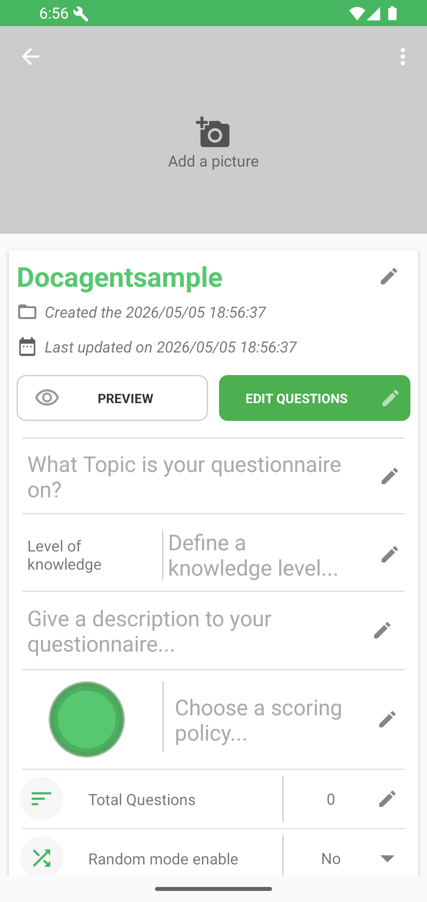
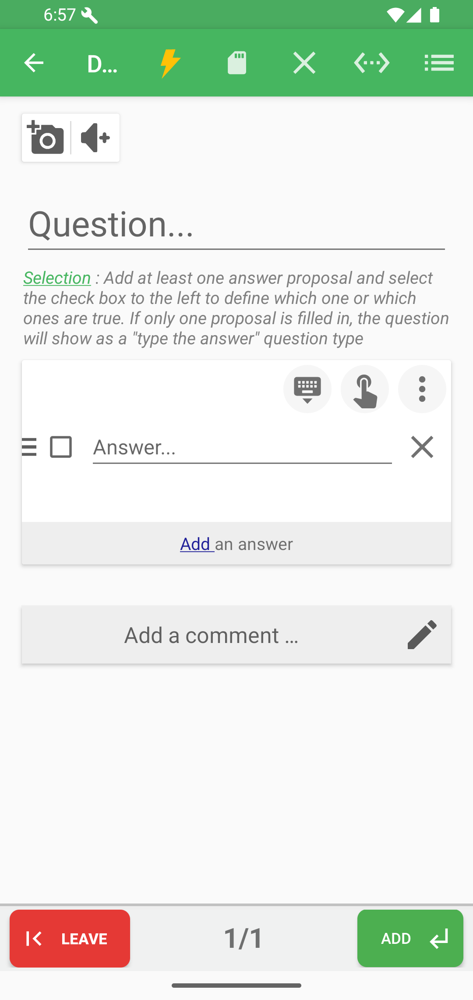
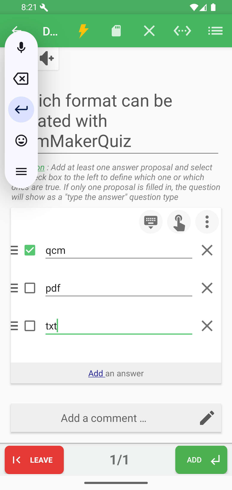
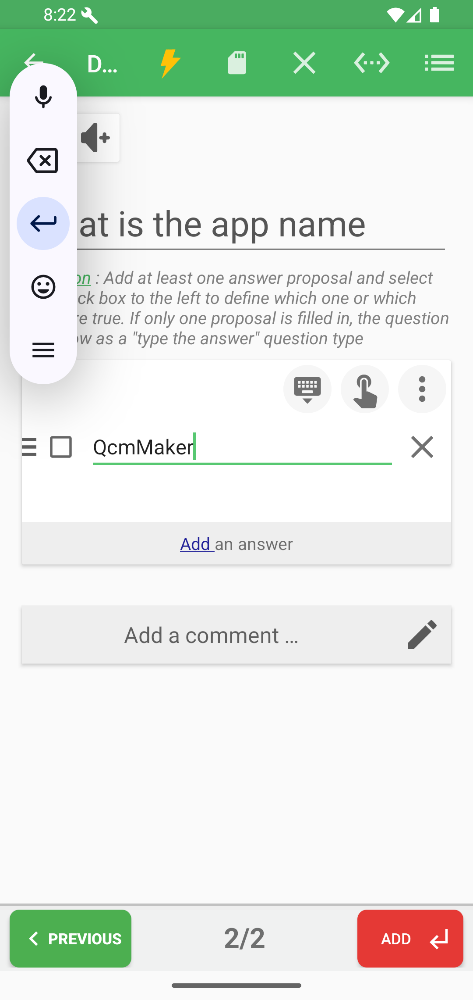

# Add A Question

From the project viewer, tap **EDIT QUESTIONS**.

In the editor:

| Area | What it does |
|------|--------------|
| Question field | Type the question. |
| Picture/audio buttons | Attach media to the question. |
| Type icon | Choose the question type. |
| Answer field | Type an answer proposal. |
| Checkbox | Mark an answer as correct. |
| Add an answer | Add another proposal. |
| Add a comment | Add correction or explanation text. |
| Save | Save changes. |
| ADD | Add another question. |

## Choose a question type

Tap the type icon in the editor to open the selector.

Common formats:

| Type | Use it for |
|------|------------|
| Selection | One or more correct answers among proposals. |
| Typed answer | A short answer the learner must enter. |
| Enumeration | Several expected answers listed by the learner. |

## Selection question

For a selection question, add several answers and tick the correct proposal or proposals.

## Typed-answer question

If a selection question has only one filled answer, QcmMaker plays it as a typed-answer question.

## Enumeration question

For an enumeration question, add every expected item as a separate answer line.

