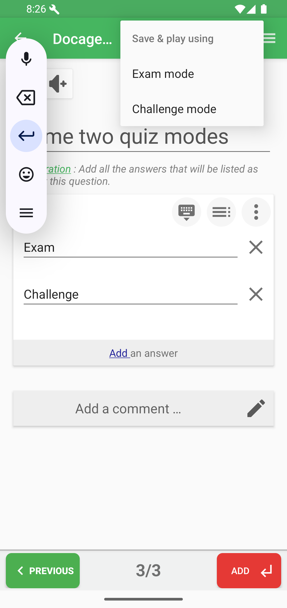
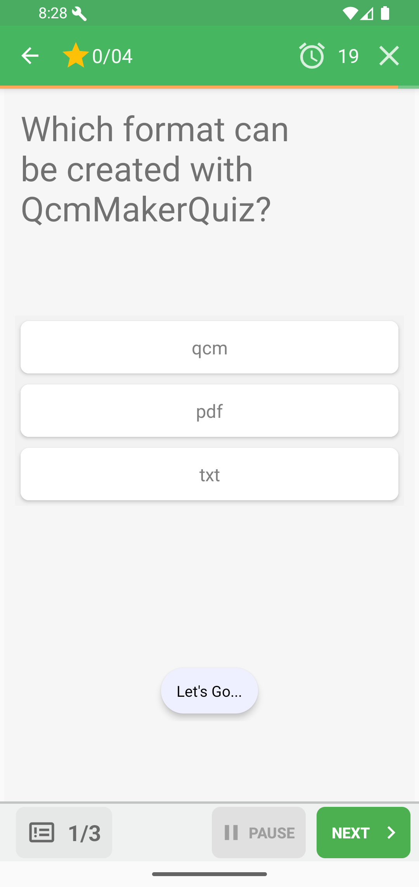
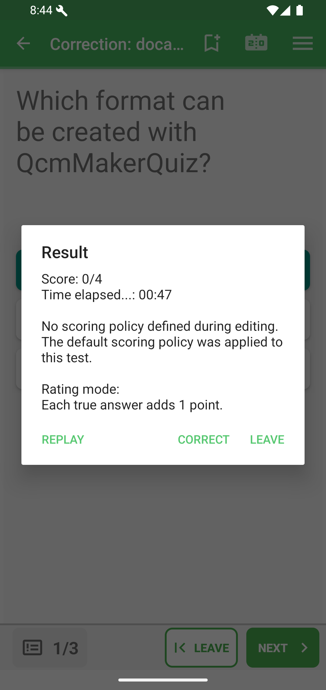

# Play Modes

QcmMaker can launch a saved quiz in Exam mode or Challenge mode.

From a quiz detail page, use the **Game mode** selector to choose the mode before playing.

From the editor, open **Save**, choose **Save & play using**, then select a mode.

## Exam Mode

Exam mode keeps a classic test layout: question, answer area, timer, page indicator, and navigation. Feedback is shown at the end.

At the end, QcmMaker shows the score, elapsed time, scoring policy, and actions to replay, correct, or leave.

## Challenge Mode

Challenge mode is timed and more immediate. It shows score, countdown, pause controls, and quick next/finish actions.

The result dialog keeps the same core actions: replay, correct, or leave.

## Correction And Score

After a result, choose **Correct** to review the quiz with the answers and navigation controls.

The Score action reopens the result summary.

